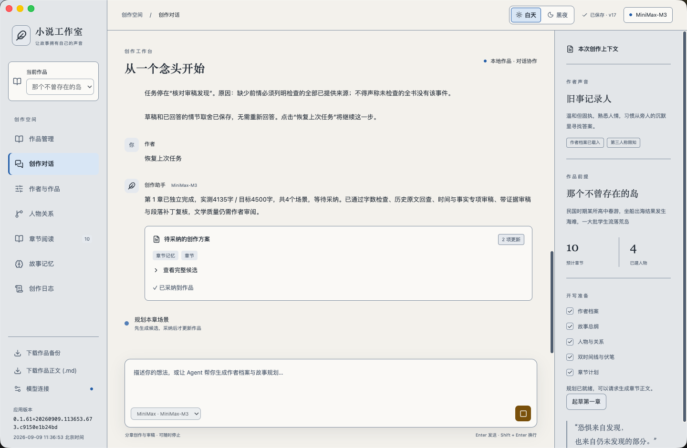
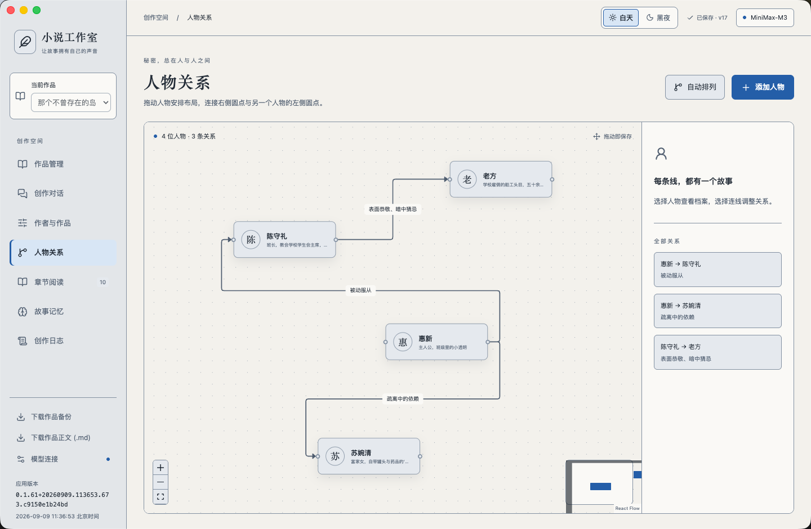
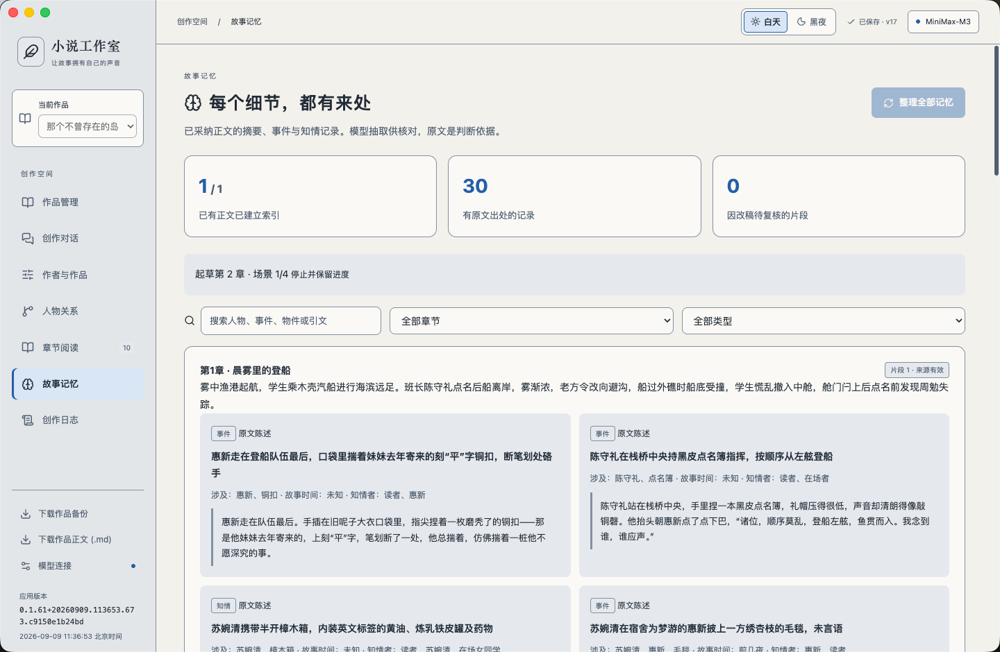
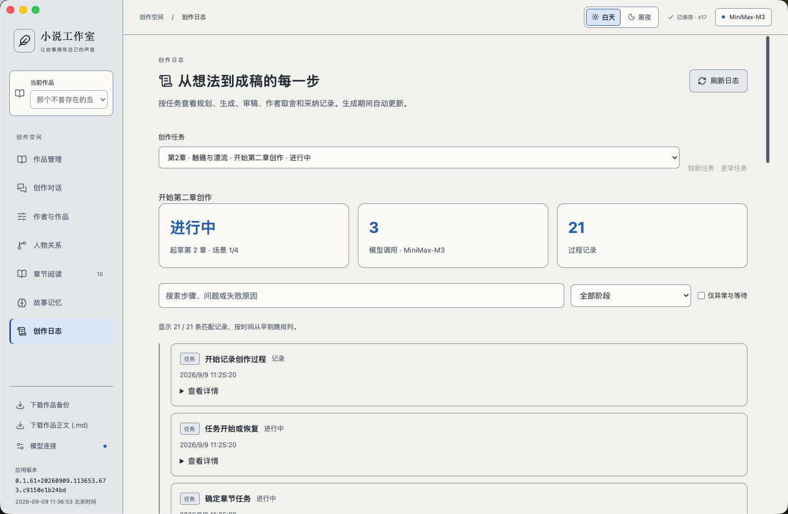

# Novel Agent Studio

**让故事拥有自己的声音。**

项目名称与仓库目录：`novel-agent-studio`；中文应用名称：小说工作室。

小说工作室是一个面向中文小说创作的本地桌面 AI 工作台。它把作者设定、故事规划、人物关系、分章写作、证据审稿和故事记忆放进同一个作品空间，帮助你从一个念头逐步推进到可以阅读、修订和导出的正文。

创作围绕“规划 → 起草 → 审稿 → 修订 → 作者采纳”展开。AI 提出方案，作者决定哪些内容进入作品；已经采纳的正文再成为后续章节的记忆来源。

当前处于持续迭代的原型阶段，已接入 GLM 与 MiniMax，已验证的桌面环境为 **macOS Apple Silicon**。作品保存在本机，生成与模型审稿需要调用你配置的云端模型。

[功能概览](#功能概览) · [界面与能力](#界面与能力) · [快速开始](#快速开始) · [模型与数据](#模型与数据) · [开发与架构](#开发与架构) · [当前边界](#当前边界)

## 为什么做这个产品

写小说时，困难往往出现在章节之间：人物上一章知道了什么，一件物品由谁保管，一段回忆发生在什么时间，刚改过的情节会不会影响后文。故事越长，这些信息越难只靠聊天记录管理。

小说工作室希望把这些工作变成可以查看和继续推进的创作过程：用人物图整理关系，用带原文出处的记忆辅助回查，用审稿与局部修订处理问题，用检查点和日志解释任务进行到了哪里。

它适合想与 AI 共同打磨故事的作者，也适合研究长篇生成、上下文管理、记忆检索和可恢复 Agent 的开发者。项目早期以悬疑、恐怖小说作为验证场景，作者设定和故事前提可以自行调整。

## 功能概览

| 能力 | 你可以做什么 |
| --- | --- |
| 多作品管理 | 新建、切换、重命名、归档和恢复作品；每部作品独立保存设定、人物、正文、对话与任务记录 |
| 作者与作品 | 设置作者声音、人格、文学积累、叙述偏好、故事前提、预计章节与篇幅 |
| 创作对话 | 讨论想法，生成故事总纲、人物、关系、双时间线、伏笔和章纲，查看候选后决定是否采纳 |
| 人物关系 | 在画布上拖动人物、建立有方向的关系、编辑档案与关系说明、自动排列布局 |
| 分章写作 | 指定章节目标字数和要求，按场景起草，检查篇幅，并在审稿通过后形成待采纳候选 |
| 审稿与修订 | 核对时间、事实、人物知情和原文依据，针对问题段落修改并复核；必要时向作者确认情节取舍 |
| 故事记忆 | 从已采纳正文提取摘要、事件、人物与物件状态、知情、故事线和伏笔，按章节、类型、关键词回查出处 |
| 创作日志 | 查看规划、调用、生成、审稿、修订、记忆和采纳记录，定位异常、等待与恢复步骤 |
| 阅读与导出 | 按章阅读、调整字号，导出已采纳正文为 Markdown，或导出完整作品 JSON 备份 |
| 模型与界面 | 切换 GLM / MiniMax，设置模型预算，使用白天或黑夜主题 |

## 界面与能力

以下四张图来自实际桌面应用，展示了示例作品与真实任务状态。图中的版本号、字数和调用次数属于截图时的记录。

### 创作对话：从一个念头到一章正文

在同一处提出创作要求、查看执行进度、处理审稿问答和审阅候选。右侧展示作者声音、作品前提和开写准备情况，让每次讨论都能对应到当前作品。

生成结果会先成为候选。采纳后才更新正式作品；失败或暂停时，已保存的场景草稿与检查点可用于后续恢复。截图同时展示了任务恢复后的章节结果与采纳记录。



### 人物关系：把人与人之间的故事画出来

人物以节点呈现，关系以有方向的连线呈现。可以拖动节点整理布局，点击人物查看与编辑档案，点击连线修改关系名、方向和说明。

这张图展示的是人物关系编辑器。诸如“表面恭敬，暗中猜忌”“疏离中的依赖”等关系，可以与人物档案一起保存到作品，作为后续创作的背景。



### 故事记忆：每个细节，都有出处

记忆页把已采纳正文整理成可检索的摘要与记录。除了“发生了什么”，还可以查看涉及的人物、物品、故事时间、知情者和原文引用，并按章节与类型筛选。

记忆依靠原文建立。章纲和未采纳候选不会自动成为正式故事事实；原文修改后，关联记录可能进入待复核状态。模型抽取也可能有误，展开的原文是作者核对的依据。



### 创作日志：看见从想法到成稿的每一步

每个任务都有自己的过程记录。可以查看当前阶段、模型调用次数、已记录的步骤，以及审稿、修订、作者回答、采纳或放弃等事件。

日志支持关键词搜索、阶段筛选和“仅异常与等待”。如果任务停住，可以先查看失败原因，再决定恢复任务或调整输入。供应商返回的 Token 用量和调用耗时会在相关记录中呈现；缺失的数据不会补造。



## 一次完整的创作流程

1. **新建作品。** 在“作品管理”建立独立空间，填写书名与故事前提。
2. **确定作者声音。** 在“作者与作品”设置叙述偏好、人物塑造方向、预计章节和每章篇幅。
3. **讨论并采纳规划。** 在创作对话中生成总纲、人物关系、时间线、伏笔与章纲，检查后采纳。规模较大的章纲会分批规划。
4. **起草当前章节。** 指定本章要求与目标字数，Agent 根据规划和此前已采纳正文，按场景完成草稿与篇幅检查。
5. **审稿并处理问题。** Agent 回查原文，核对时间、事实与证据，修改指定段落并复核。遇到无法自行裁定的关键情节，会在对话中请求作者回答。
6. **采纳并继续下一章。** 查看候选，采纳正文与记忆，再推进后续章节。可以随时阅读已采纳正文，并导出 Markdown 或作品备份。

可以从这样的请求开始：

> 我想写一部发生在海岛上的悬疑小说，计划 10 章，每章约 4000 字。先帮我讨论故事前提、人物冲突和整体走向。

规划采纳后，再提出具体的章节要求：

> 起草第 1 章，目标 4000 字。从登船开始，让主角通过行动与其他人物建立关系，结尾留下一个可以在后续回收的疑点。

需要修订时，说明范围与要保留的内容：

> 检查这一章的时间顺序和人物知情是否矛盾。保留已经确认的情节，只处理有明确依据的问题段落。

## 快速开始

### 准备环境

已验证环境为 **macOS Apple Silicon、Node.js 22.22.3 和 npm**。项目使用 Node.js 内置 SQLite；构建依赖要求 Node.js 至少为 22.12.0，建议按已验证版本启动。

首次准备本地 Embedding 模型需要访问 Hugging Face，下载约 129 MB 文件。完成准备后，向量计算在本机运行。真实创作还需要具有对应模型调用权限与额度的 API Key。

### 配置本地密钥

下载或克隆仓库后，在项目根目录执行：

```sh
# 已存在 .env 时保留原文件
cp -n .env.example .env
chmod 600 .env
```

编辑 `.env`，填写你要使用的供应商配置。只使用一个供应商时，可以留空另一项密钥：

```dotenv
ZAI_CODING_CN_API_KEY=
MAIN_MODEL=glm-5.2
MINIMAX_API_KEY=
```

`.env` 是本机配置，已被 Git 忽略；可以提交的是不含密钥的 [`.env.example`](.env.example)。桌面开发版和命令行评测脚本默认读取项目根目录 `.env`。

### 安装并启动

在项目根目录执行：

```sh
cd desktop-app
npm ci
npm run prepare:embedding
npm run desktop
```

`prepare:embedding` 按固定模型版本下载文件并校验 SHA-256；已有文件校验通过时直接复用。模型权重不提交到 Git，下载清单与上游说明保存在 [`desktop-app/models/`](desktop-app/models/)。

启动后进入“模型连接”，检查供应商、模型与密钥状态。也可以在这里手动填写密钥。需要测试接口时点击“保存并测试连接”，该操作会发起真实模型请求。

### 只看浏览器演示

如果只想先查看界面，在完成 `npm ci` 后，于 `desktop-app` 目录执行：

```sh
npm run dev
```

浏览器访问 [本地演示页面](http://127.0.0.1:5178/)。该模式使用固定演示数据，不读取密钥、不调用模型，也不读写桌面应用中的真实作品。

### 打包桌面应用

在 `desktop-app` 目录完成模型准备后执行：

```sh
npm run pack
```

生成的应用位于：

```text
desktop-app/release/NovelAgentStudio-darwin-arm64/NovelAgentStudio.app
```

安装版可在“模型连接”中手动填写密钥，或从应用数据目录的 `.env` 导入。密钥不会随应用打包。当前打包目标为 macOS arm64，尚未提供签名、公证或 Windows / Linux 交付验证。

## 模型与数据

### 模型接入

当前适配 GLM 和 MiniMax，由 Electron 主进程直接请求所选供应商的官方接口。默认值来自 [`runtime/catalog.mjs`](desktop-app/runtime/catalog.mjs)：

| 供应商 | 默认模型 | 默认接口 |
| --- | --- | --- |
| GLM | `glm-5.2` | `https://open.bigmodel.cn/api/coding/paas/v4` |
| MiniMax | `MiniMax-M3` | `https://api.minimaxi.com/v1` |

MiniMax 也支持在设置中使用 `https://api.minimax.cn/v1` 或 `https://api.minimax.io/v1`。其适配使用 OpenAI 兼容接口，协议说明见 [MiniMax 官方文档](https://platform.minimaxi.com/docs/api-reference/text-openai-api)。当前没有任意供应商、自定义代理地址或本地生成模型的通用接入界面。

GLM 当前配置指向 Coding Plan 入口。官方将该套餐限制在指定工具与产品环境中，独立小说应用的套餐适用性尚未确认；请先核对你账户的使用范围。接口连通不等于已确认套餐资格或扣费方式，详见 [GLM Coding Plan 官方说明](https://docs.bigmodel.cn/cn/coding-plan/quick-start)。

一次章节任务可能包含多次规划、起草、审稿和修订请求，实际消耗取决于材料长度、执行步骤及供应商规则。应用不会在失败时自动切换供应商或计费入口。

### 作品数据保存在哪里

桌面应用默认保存到：

```text
~/Library/Application Support/novel-agent-studio/
```

| 数据 | 保存与使用方式 |
| --- | --- |
| 作品与正文 | 本机文件保存，各作品独立目录；应用没有自建的云端作品同步服务 |
| 候选、检查点和历史 | 保存到所属作品目录，用于采纳、恢复与版本核对 |
| 故事记忆与向量索引 | 本地 JSON / SQLite 保存，Embedding 在本机计算，无需外部数据库服务 |
| 模型请求 | 会向所选供应商发送本次任务需要的设定、原文、历史片段、指令或审稿材料 |
| API Key | 导入或手动保存后通过系统安全存储加密；界面不回显已有密钥，密钥不注入前端构建 |

**本地保存不等于完全离线。** 生成、模型审稿和结构化记忆抽取需要联网；查看已保存作品、人物关系和已有记忆可以在本机进行。本地向量模型只负责检索相关文本，不负责生成小说正文。

### 配置优先级与备份

桌面端优先使用本机已保存的加密配置。某个供应商缺少密钥时，才尝试导入 `.env`：

- 启动环境变量 `NOVEL_AGENT_ENV` 指定的文件优先。
- 未指定时，开发版读取项目根目录 `.env`；安装版读取应用数据目录 `.env`。
- `NOVEL_AGENT_DATA_DIR` 可指定独立应用数据目录。

修改 `.env` 不会覆盖已经保存的加密密钥；更新现有密钥请使用“模型连接”。这两个 `NOVEL_AGENT_*` 变量应传给启动进程，不是写进 `.env` 的模型配置字段。

“下载作品正文 (.md)”只导出已采纳章节的书名、标题和正文。“下载作品备份”导出作品 JSON，不包含全部运行日志、检查点和本地索引；完整迁移应在退出应用后备份整个应用数据目录。备份 JSON 可能包含作者真相、设定、对话和候选，分享前请核对内容。当前尚无备份导入界面，文件恢复步骤见[桌面端存储与恢复说明](desktop-app/README.md#存储与恢复)。

## 开发与架构

应用由 Electron 桌面宿主、React 界面和独立的创作运行时组成。界面通过受限 IPC 与主进程通信；模型请求、文件读写和密钥存储由主进程管理。

| 层次 | 技术与职责 |
| --- | --- |
| 界面 | React、TypeScript、Vite；作品管理、创作对话、阅读、记忆与日志 |
| 人物画布 | React Flow；人物节点、关系连线和布局编辑 |
| 桌面宿主 | Electron；窗口、IPC、系统安全存储和应用数据目录 |
| 创作运行时 | JavaScript ES Modules、Zod；任务识别、分批规划、分场景写作、审稿、局部修订、候选采纳与检查点 |
| 记忆检索 | Transformers.js、本地 ONNX Embedding、SQLite；向量相似度与关键词评分融合 |
| 模型适配 | GLM / MiniMax 官方 HTTP 接口；模型配置、输入与输出预算、超时和错误处理 |

规划任务以有向依赖图记录节点状态，便于从失败步骤继续；当前节点调度串行执行。长章按场景生成，审稿材料按预算分批组织，修改针对具体段落进行。上下文计数采用代理估算和余量，并非供应商精确 tokenizer；超过可处理范围时会明确停止。

### 常用命令

以下命令均在 `desktop-app` 目录执行：

| 命令 | 用途 |
| --- | --- |
| `npm ci` | 按锁文件安装依赖 |
| `npm run prepare:embedding` | 下载并校验固定版本的本地向量模型 |
| `npm run dev` | 启动浏览器演示 |
| `npm run desktop` | 构建并启动桌面应用 |
| `npm start` | 使用上一次构建启动桌面应用 |
| `npm test` | 运行领域逻辑、存储、检索、预算、规划、审稿、恢复与配置等自动化测试 |
| `npm run pack` | 构建并打包 macOS arm64 应用 |

构建和开发启动会自动递增应用版本，并生成包含北京时间与源码指纹的 [`build-info.json`](desktop-app/build-info.json)。界面左下角、桌面“关于”窗口与打包元信息使用同一份构建信息。打包后需要重新打开新版应用，已运行的旧进程不会自动更新。

### 目录结构

```text
.
├── desktop-app/
│   ├── src/                 # React 界面与状态
│   ├── electron/            # 桌面入口、IPC 与预加载桥接
│   ├── runtime/             # 创作流程、领域约束、记忆和存储
│   ├── models/              # 模型清单与上游说明，权重通过脚本下载
│   ├── scripts/             # 版本、构建、评测与验证脚本
│   ├── tests/               # 自动化测试
│   └── docs/                # 运行机制与实现说明
├── docs/images/             # 本 README 的四张产品截图
├── agent-design/              # 产品能力、作者档案与架构设计资料
├── memory-design/           # 记忆系统方案与验证记录
├── evaluation/                   # 开发样本与评测协议
├── 01-research/ … 05-review/       # 写作研究、定位、大纲、章节和复盘模板
├── revisions/                 # 示例作品原稿、修订版与核对记录
└── .env.example            # 不含密钥的配置示例
```

## 当前边界

- **文学质量需要作者判断。** 自动测试验证程序行为，模型审稿通过表示流程完成；情节、文风、原创性与可发表质量仍需人工审读。
- **长篇按章推进。** 当前没有无人值守写完整本、自动采纳所有章节的队列。单章目标支持 100—10000 字，实际任务仍受模型权限、预算、超时与审稿结果影响。
- **记忆检索有覆盖范围。** 摘要、事件和知情记录来自模型抽取，检索也可能漏掉相关原文；没有全书语义一致性保证。
- **恢复基于已落盘内容。** 已保存的检查点、场景和成功步骤可以复用；运行中的请求不会在进程退出后继续传输，未收到的输出无法恢复。当前按阶段更新进度，不逐字流式展示正文。
- **正文修改通过候选采纳。** 阅读页用于阅读和查看章节；尚未提供直接编辑正文的完整富文本编辑器、版本对比面板或备份导入界面。
- **本机多作品管理。** 模型连接配置在作品之间共享，尚无多人协作、账号权限或云同步。

## 更多文档与反馈

- [桌面端使用说明](desktop-app/README.md)：操作路径、配置优先级、存储恢复和评测命令。
- [模型预算与本地混合检索](desktop-app/docs/model-budget-and-local-retrieval.md)：分批审稿、段落修订和本地索引。
- [分层记忆与增量更新](desktop-app/docs/layered-memory-and-incremental-updates.md)：记忆如何建立、回查和更新。
- [时间与事实连续性](desktop-app/docs/temporal-and-factual-continuity.md)：时间、知情与证据的处理方式。
- [审稿恢复与作者确认](desktop-app/docs/review-recovery.md)：审稿、问答、复核与任务恢复。
- [创作日志](desktop-app/docs/creation-logs.md)：可观察的过程记录与历史任务查询。
- [作者档案与开写规划](agent-design/author-profile-and-planning.md)：作者声音、故事规划和人物设计。
- [评测协议](evaluation/evaluation-protocol.md)：如何区分程序验证、模型审稿和文学质量评价。

欢迎通过仓库 Issues 提交问题或建议。复现信息可以包含应用完整版本、系统、供应商与模型、操作步骤和报错阶段；涉及作品时，可以提供能够复现问题的最小示例。请不要在公开反馈中附带 API Key 或未经整理的个人作品备份。
