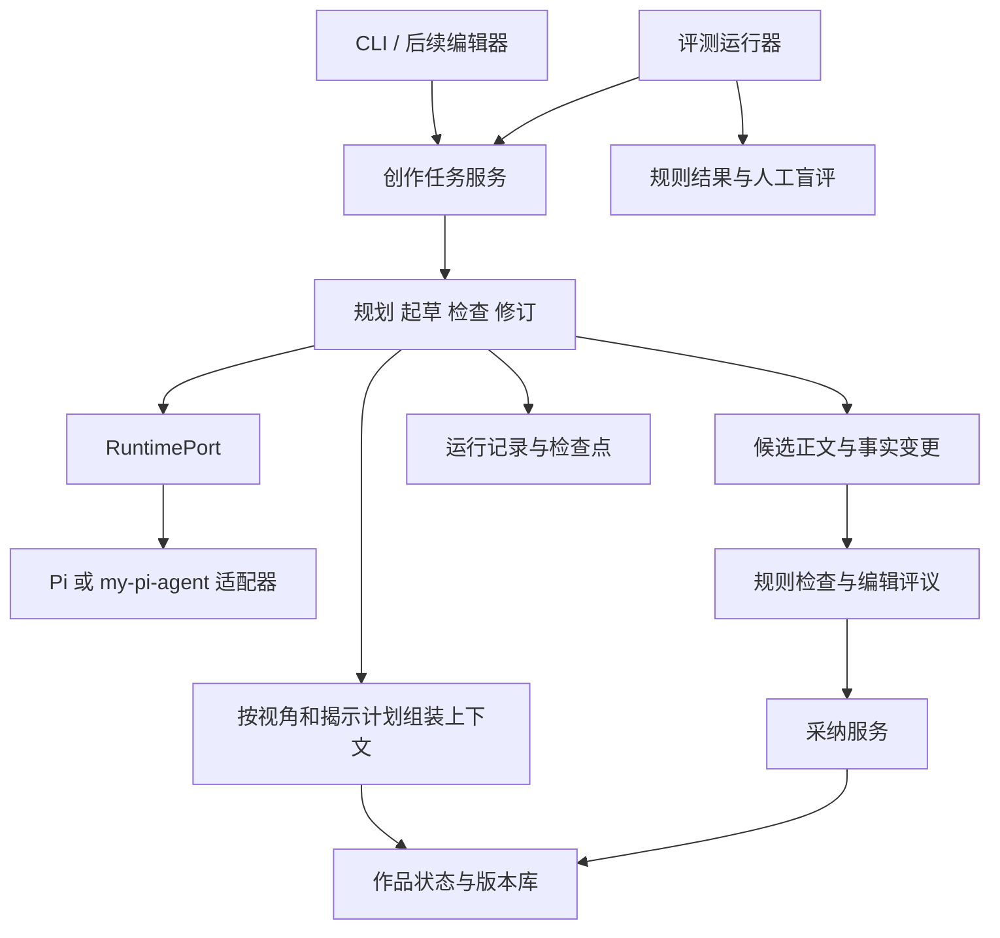

# 小说 Agent 架构方案

状态：建议方案，尚未实现。默认沿用 TypeScript/Node 技术方向，减少与既有运行时的集成变量；不为引入新语言拆服务。依赖版本在接入实验中核定。

## 模块边界

提示词与上下文选择可独立版本化。评测期模型只能使用提供的任务工具，不允许任意读取评测答案。初始 CLI 用于运行任务、检查结果和比较版本；界面设计待真实使用动作明确后进行。

## 领域对象与不变量

| 对象 | 核心字段 | 不变量 |
|---|---|---|
| Book / Branch | bookId、branchId、headRevision | 所有数据访问携带作品和分支身份 |
| Fact | factId、内容、成立区间、状态、来源版本 | 候选、正式、已替代分开；人物相信的事不自动成为世界事实 |
| Knowledge | 主体、factId/claimId、获知场景、确信程度、依据 | 角色认知与读者信息分开；推测可以错误；获知不能早于来源 |
| Scene | sceneId、事件时间、叙述位置、视角、依赖事实 | 事件顺序与叙述顺序分别存储 |
| Reveal | clueId、可展示场景、禁止揭示内容、兑现状态 | 正文禁止提前揭底；规划器可见的内容不等于写作者可见 |
| ManuscriptRevision | revisionId、parentId、内容散列、依赖版本 | 原文不可变，修订生成新版本 |
| ChangeSet | baseRevision、候选正文、候选事实、影响场景、采纳状态 | 采纳前不改变正式事实；基础版本过期必须重新合并 |
| Run | runId、requestId、attemptId、输入快照、阶段、预算、终态 | 同一请求可有多次尝试，只能幂等采纳一次 |

事实和认知关联可以是明确规则，也可以是来源证据；仅靠关键词检索无法发现全部间接依赖。改设定时先图上查直接依赖，再审查可能的间接影响；未知项明确列出。

## RuntimePort 契约草案

输入：任务阶段、显式上下文、模型配置、工具白名单、调用上限、输出上限、截止时间、取消信号、runId/attemptId。

事件：文本增量、工具开始/结果、usage 更新、阶段诊断。

结果：结构化产物、结束原因、工具结果、usage（含可用性）、模型实际标识。模型结果是候选数据，不能直接写正式状态。

错误：取消、超时、预算耗尽、模型错误、工具错误、无效输出、版本冲突。错误可附带草稿，但草稿不是完成结果。运行服务负责重试策略，避免 SDK 和上层无限叠加重试。

第一轮每项任务最大 6 次模型调用、最多 2 轮修订作为实验默认值；写入运行配置，可调整，不作为质量保证。硬性总超时由应用执行；成本无法核算时仍以调用/输出上限限制。

## 状态与恢复

Run：queued → running → awaiting_acceptance → completed；running 可进入 failed / cancelled / interrupted。恢复创建新 attempt，读取最后一个完成阶段的检查点和输入散列，不猜测半截正文已执行成功。

ChangeSet：proposed → accepted / rejected / conflicted。accepted 在一个事务中写入新版本、事实变更、审计记录及分支 head。相同 requestId 重复采纳返回原结果；baseRevision 与当前 head 不同则返回冲突。

建议本地使用 SQLite 存元数据、结构化状态、版本正文和检查点，Markdown 为导入导出视图。这样首期采纳可以保持单事务；若未来把大正文放文件存储，需额外设计提交清单与崩溃恢复，不能沿用单事务假设。

日志可记录中间计划、上下文来源和修改理由等显式产物，不要求保存模型隐藏推理。无事实变更的草稿也有版本与来源。删除或回滚新建分支状态，不抹掉历史运行证据。

## 上下文与创作循环

1. 冻结作品分支版本和任务约束。
2. 规划器读取允许的全局真相，生成因果、场景和揭示计划。
3. 上下文构建器向写作者提供本场景可见事实、人物认知、风格约束和有限前文；禁止信息不以谜底原文重复注入。
4. 写作者生成正文和候选新增事实，工具权限同样受视角范围约束。
5. 检查器可读取更广的状态，但返回写作者的反馈必须过滤谜底；修复“读者不该知道”的问题不能反过来泄露真相。
6. 在预算内修订，生成 ChangeSet 与残留问题，等待采纳或在实验分支按配置处理。

长文本超预算时，优先带入依赖事实和可追溯的摘要；缺失关键上下文则停止并报告，不能静默截断。摘要不替代原文作为最终核验依据。

## 从原型到可用的推进顺序

1. 固定评测协议与种子；先验证数据可加载，不声称质量提升。
2. 完成 RuntimePort 接入实验；跑直接模型和风格提示词基线。
3. 实现作品状态、上下文选择和一次受约束生成，比较连续性/泄密结果。
4. 加入影响分析、修订与采纳事务，进行故障注入和恢复实验。
5. 加审稿循环，比较收益及调用成本；只有产生稳定收益才引入多 Agent。
6. 扩充到跨多个故事的长程评测；最后按阅读、编辑和修订动作设计界面。

每阶段交付实际运行记录和失败归因；质量没有提升时允许删除机制或回退。当前没有真实模型评测结果。

## 文风控制接入

风格档案按作品、视角与场景分层，作为有版本的上下文输入；规则检查后插入可选的文风诊断与局部修订，再执行事实/视角复检。诊断须带原文位置与理由，无问题允许保持原文。新增事实仍走 ChangeSet，不因润色绕过采纳。详见 [文风与AI味控制](style-and-ai-pattern-control.md)。

## 作者档案和规划包

新增 AuthorProfile（人格、文学积累、语言与引用偏好）、NarratorProfile（叙述契约）、CharacterVoice（角色声音）、Relationship（有方向且随事件变化）、PlanRevision（总纲、章纲、双时间线、揭示表）。这些是待实现的独立领域对象。

正式写作先验证规划包 ready 状态，生成任务绑定作者档案、规划和正文基础版本；规划变更通过影响分析进入新版本。作品偏好服从事实/认知限制，角色声音不直接继承作者知识。片段实验使用单独模式与最小场景计划。详细模板和验收场景见 [作者档案与开写规划](author-profile-and-planning.md)。
