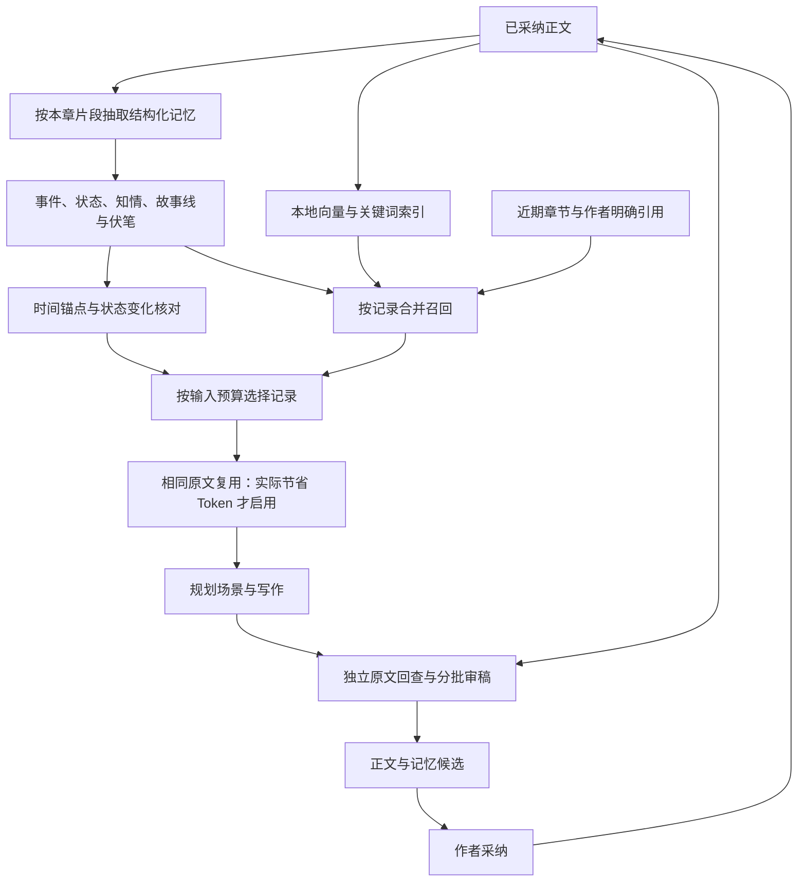

# 分层记忆与增量更新

当前实现以新数据、新任务为交付范围，不提供旧检查点迁移。修改日期：2026-09-09。

## 数据与职责

原文是出处，向量是检索入口，结构化记忆保存模型抽取的陈述；时间线负责另行核对关系。相似度、时间先后和记录新旧都不自动决定哪个陈述是真相。人物信念、传闻、知情范围与有意留白继续保留。

## 增量更新

记忆抽取请求只读取一个本章片段，不读取此前章节。缓存依赖因此改为本章正文哈希、片段位置与抽取协议，不再依赖整段前史。复用前逐项验证正文哈希、sourceStart/sourceEnd、sourceText 与每条 quote。

修改第1章，只使第1章的旧抽取结果失效；未改的后章可以复用。跨章时间与事实关系仍在新任务中重新汇总和审稿，不因抽取结果可以复用而沿用旧的连续性结论。新增或修订正文的记忆仍随候选一起等待采纳，候选不进入正式向量索引。

## 召回与预算

`memory-selection.mjs` 将近期章节、作者明确引用、向量命中的原文和文字相关性作为并行召回来源，按记录合并。取消原来先取最多12个条目、再用向量命中过滤记录的串行筛选。即使早期线索没有命中人物名，只要原文被检索命中，对应记录仍能进入预算选择。

近期与明确引用记录必需保留；其他记录使用最多6,000估算Token的软额度，并随当前模型的输入空间缩小。与当前内容相关的知情记录、故事线和伏笔同样参与排序。未命中的空条目摘要不单独塞入写作上下文；相互矛盾的记录不会被合并为一个“最新真相”。连续性时间锚点仍走独立通路。

创作日志记录有效、选中、必需、原文命中记忆的数量。任务manifest保留所选记录的稳定标识与召回原因，最终每次写作请求另记录实际装入的记录范围。

## 原文传输复用

`memory-transport.mjs` 只改变发送给写作者的表示。引用能复用同章已经提供的近期原文、明确引用全文、检索段落或公共原文池；不同章节即使字面相同，也不混用来源归属。

quoteIndex对应quoteRefs；引用用限定来源、数组下标及UTF-16起止偏移标识。运行时可逐字回填，正式记忆与审稿仍使用完整原文，不依赖模型抄写。记录中的text、knownBy、epistemic、continuity不因引文共享而合并或省略。

每次装配都对同一批记录比较内联表示与复用表示的Token估算，实际更省才使用复用。短引文通常继续内联。结构化纠错和重试消息也计入最终预算；不可拆的必需内容超出模型窗口仍明确停止，不静默裁剪。

## 验证

- `npm test`：来源变更、召回、冲突记录、无损还原、重试、预算与已有写作流程。
- `node scripts/verify-memory-v2.mjs 作品副本JSON [--live]`：真实本地向量推理、实际记录选择、相同记录的传输前后比较、增量复用。`--live`验证一条记忆的引用对象与陈述性质，再由程序回填原文，不评估文学质量。
- `node scripts/verify-memory-v2-desktop.cjs`：隔离作品库内验证打包桌面、真实本地Embedding、模型预算、候选重启保留及采纳；云端写作响应模拟。
- `npm run pack`：更新完整可见版本并打包。报告存入`verification/memory-v2/`。
